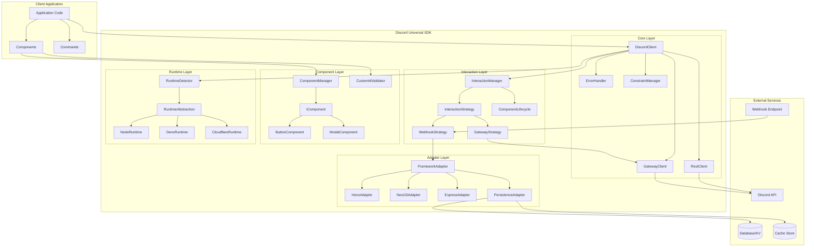
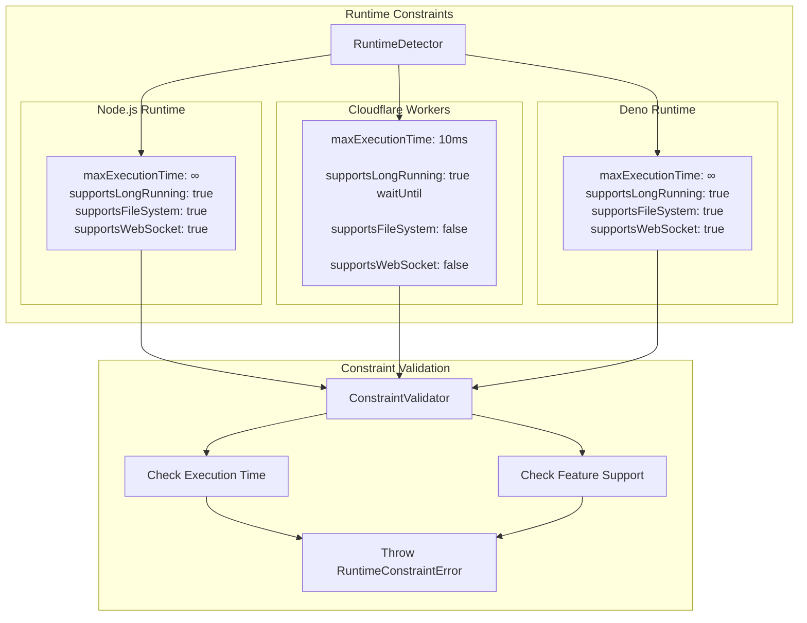
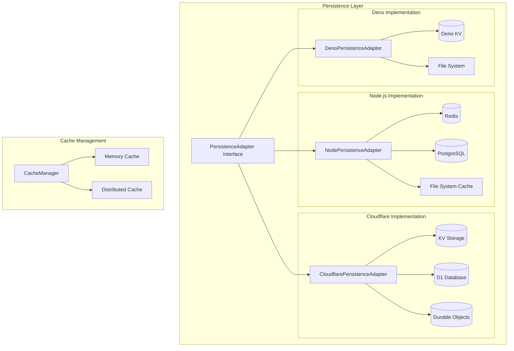
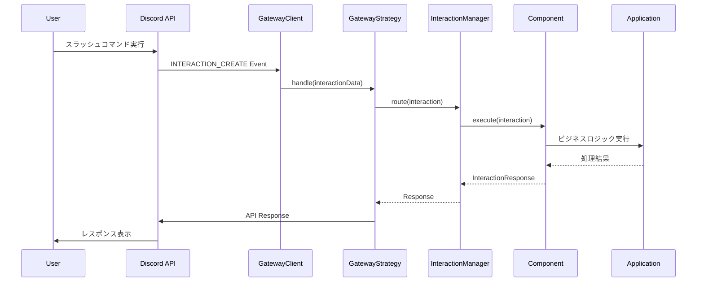
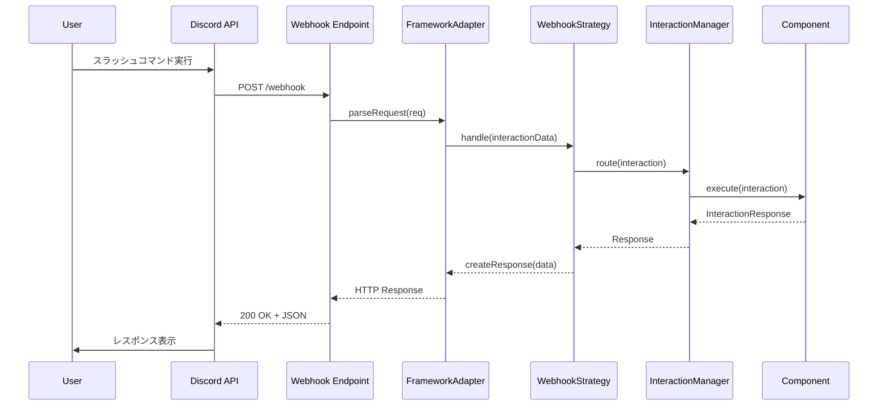
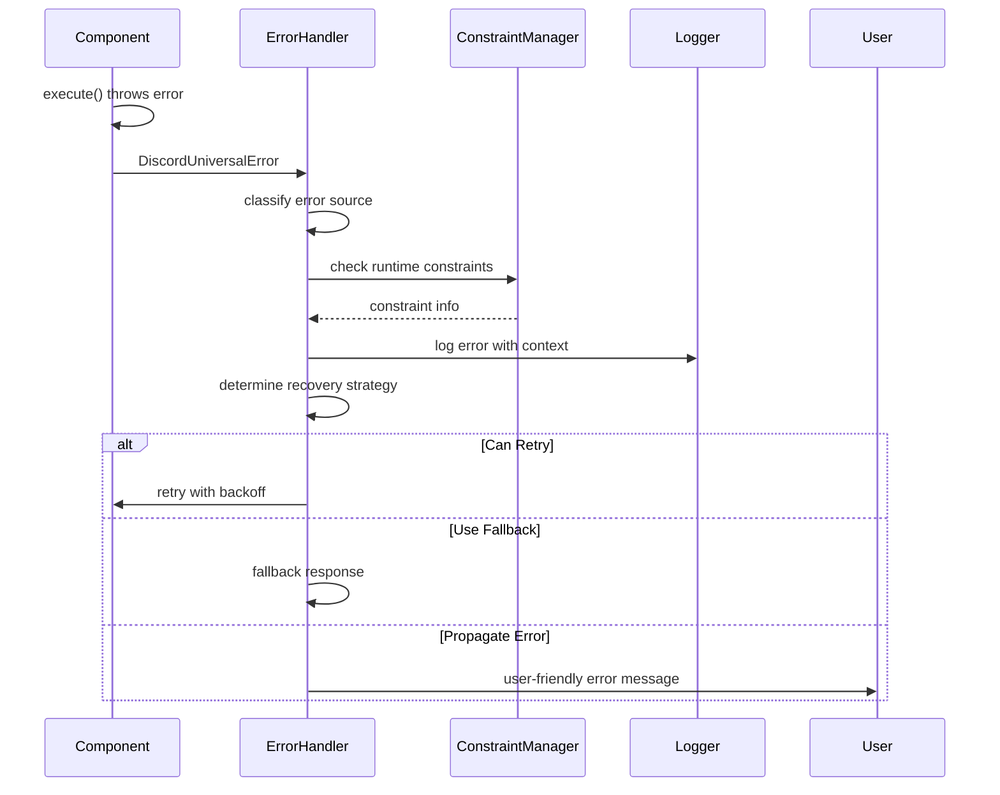
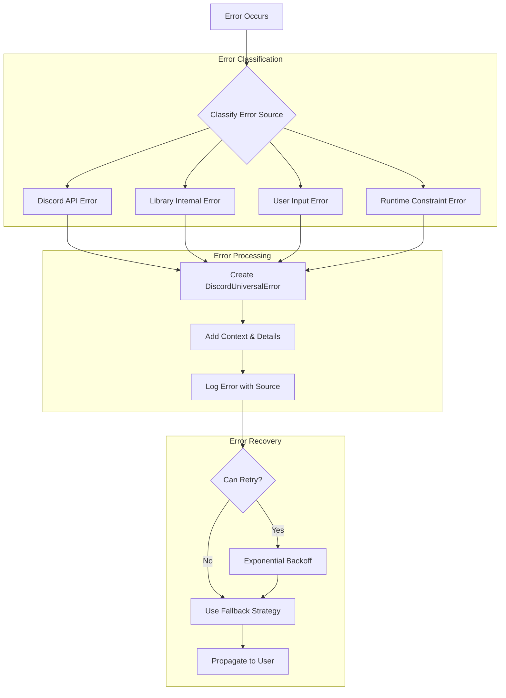
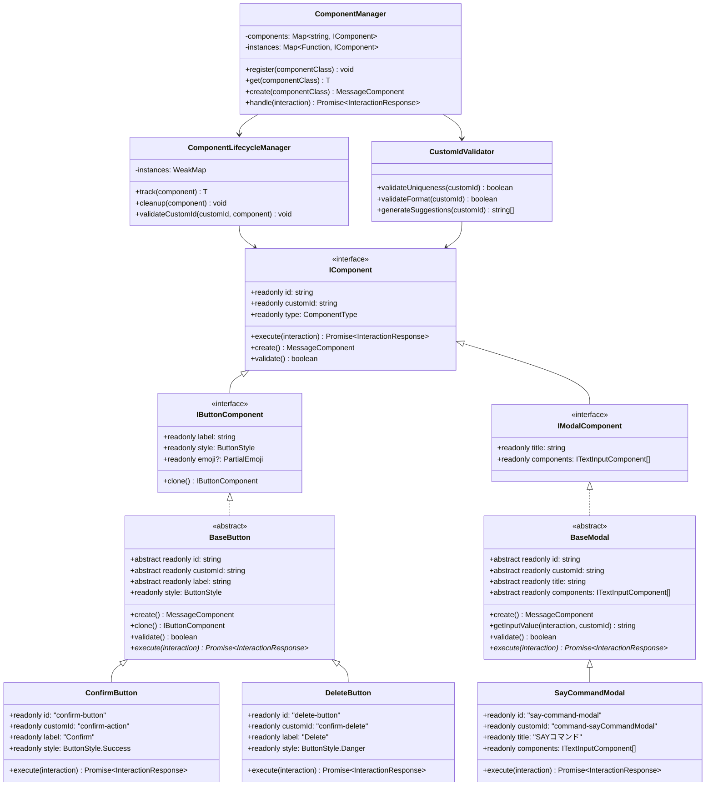

# Discord Universal SDK - システム設計図

## 1. システム全体アーキテクチャ

## 4. ランタイム制約管理図

## 5. データ永続化アーキテクチャ

## 6. Interaction処理シーケンス図

### 6.1 Gateway方式でのInteraction処理

### 6.2 Webhook方式でのInteraction処理

### 6.3 エラーハンドリングフロー

## 7. エラーハンドリングフロー図

## 8. コンポーネントクラス階層図

## 9. 関連ドキュメント

- [要件定義書](./REQUIREMENTS.md) - システム要件と目的
- [詳細設計仕様書](./DESIGN.md) - 実装アーキテクチャと設計パターン

### 設計整合性チェックポイント

- [ ] 設計仕様書のクラス構造がクラス図と一致しているか
- [ ] 処理フローの変更がシーケンス図に反映されているか
- [ ] 新しいコンポーネントがコンポーネント構成図に追加されているか
- [ ] README.mdの特徴説明と図の内容が一致しているか
