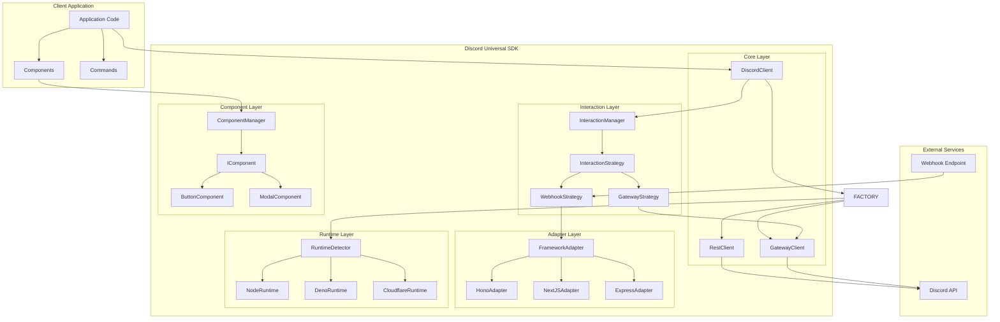
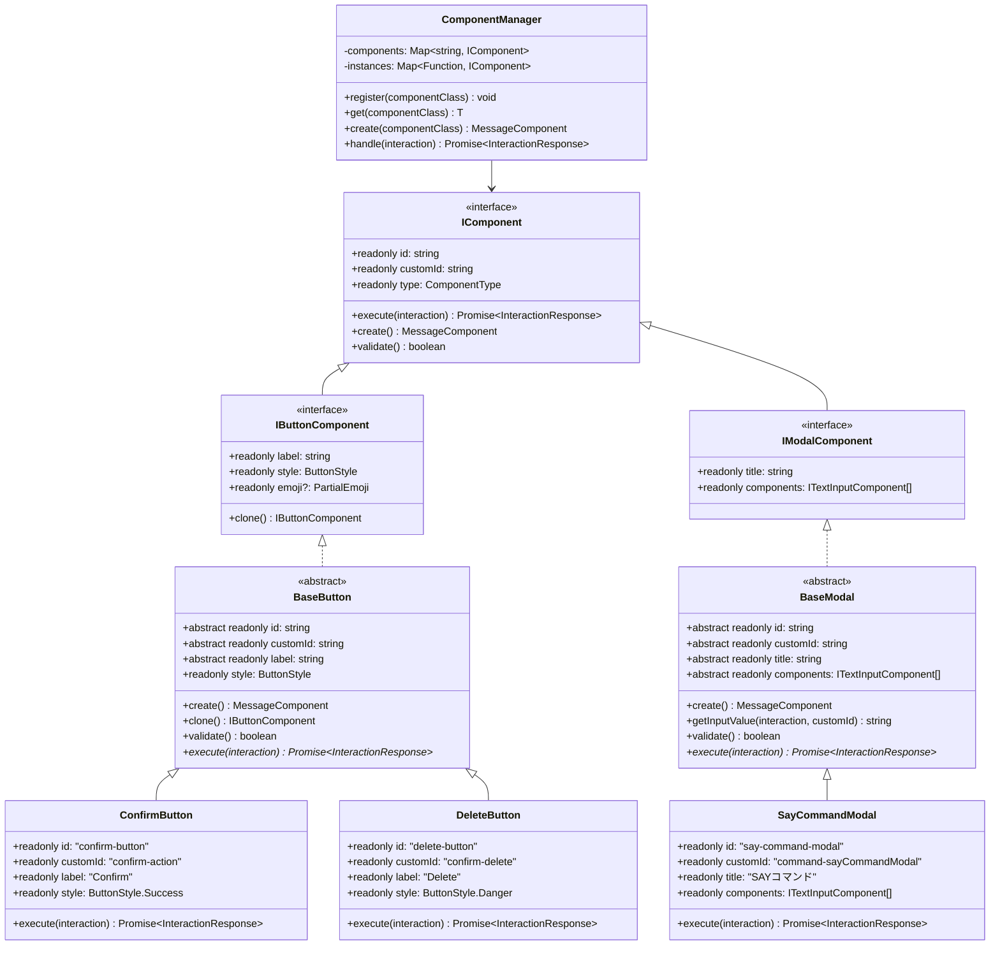
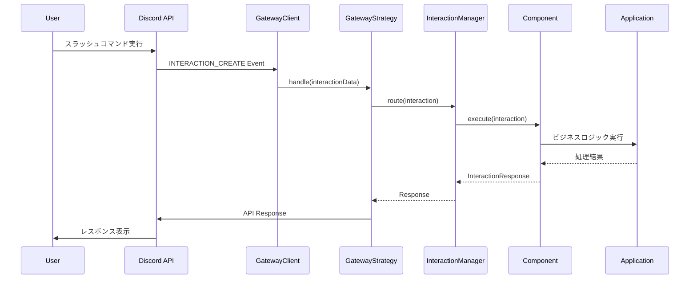
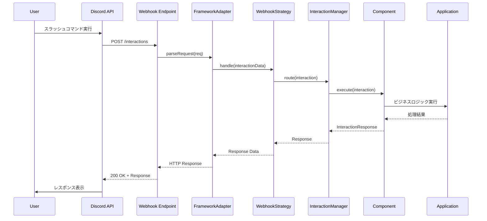
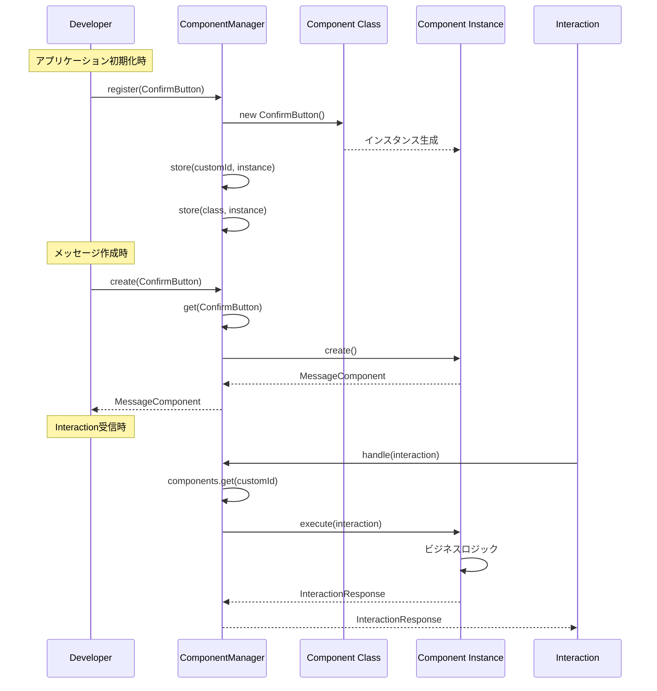
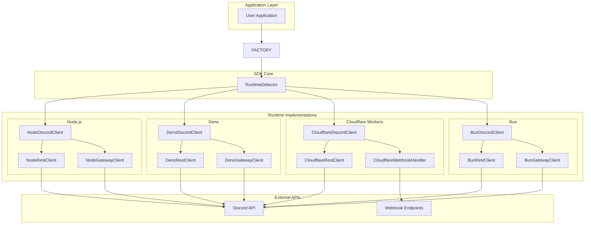
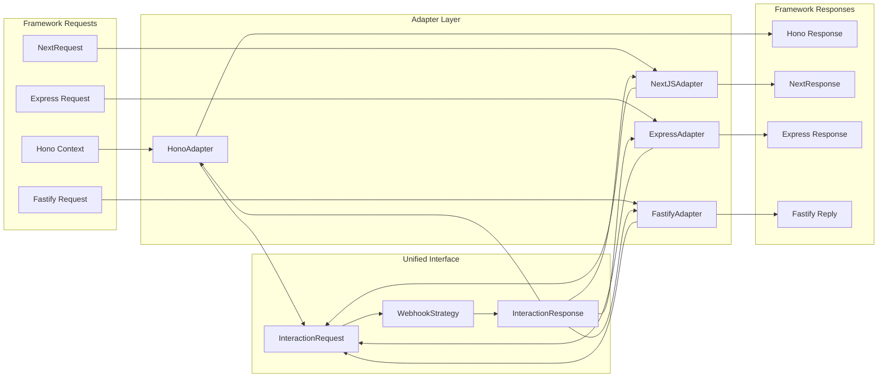
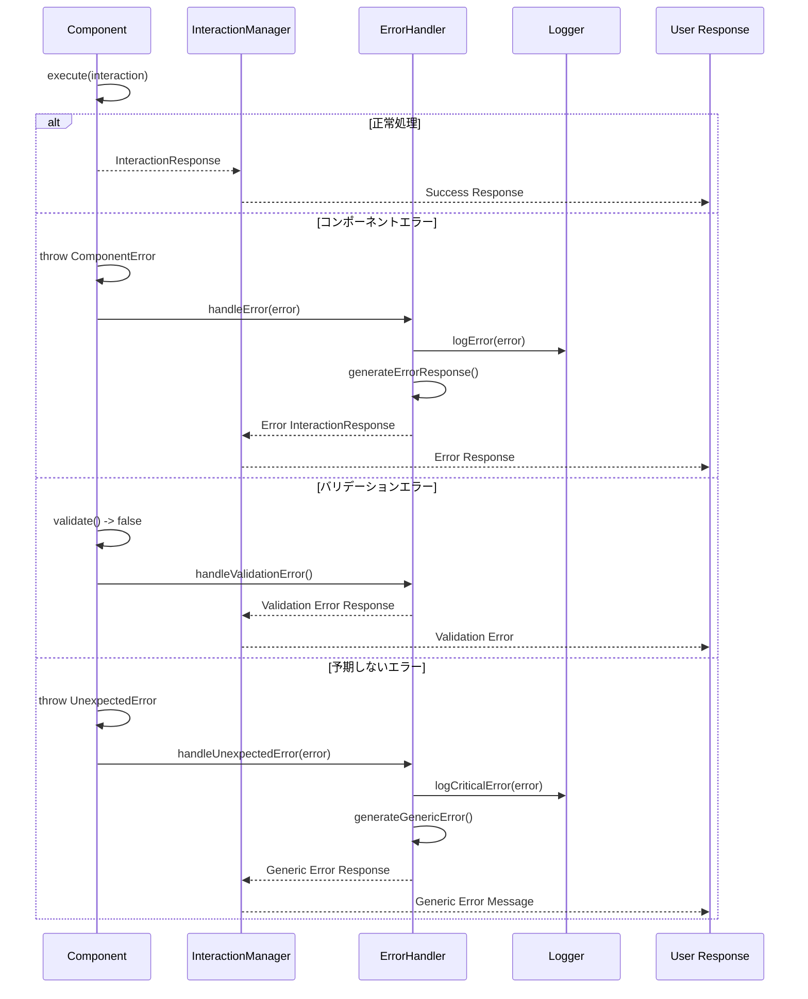

# Discord Universal SDK - システム設計図

## 1. システム全体アーキテクチャ



## 2. コンポーネントクラス階層図



## 3. Interaction処理シーケンス図

### 3.1 Gateway方式でのInteraction処理



### 3.2 Webhook方式でのInteraction処理



## 4. コンポーネント登録・実行フロー



## 5. マルチランタイム対応アーキテクチャ



## 6. フレームワークアダプター構成



## 7. エラーハンドリングフロー



## 8. データ永続化・キャッシュシステム構成

```mermaid
graph TB
    subgraph "Application"
        CLIENT[DiscordClient]
        CONFIG[PersistenceConfig]
    end

    subgraph "Data Layer"
        MANAGER[DataManager]

        subgraph "Storage Strategies"
            MEMORY[MemoryCacheStrategy]
            PRISMA[PrismaKyselyStrategy]
            CUSTOM[CustomStorageStrategy]
        end

        subgraph "Data Types"
            USER_CACHE[UserData]
            GUILD_CACHE[GuildData]
            MESSAGE_CACHE[MessageData]
            CHANNEL_CACHE[ChannelData]
        end
    end

    subgraph "Storage"
        HEAP[Heap Memory]
        DATABASE[Database (SQLite/PostgreSQL/MySQL)]
        CUSTOM_STORE[Custom Storage]
    end

    CLIENT --> CONFIG
    CONFIG --> MANAGER

    MANAGER --> MEMORY
    MANAGER --> PRISMA
    MANAGER --> CUSTOM

    MANAGER --> USER_CACHE
    MANAGER --> GUILD_CACHE
    MANAGER --> MESSAGE_CACHE
    MANAGER --> CHANNEL_CACHE

    MEMORY --> HEAP
    PRISMA --> DATABASE
    CUSTOM --> CUSTOM_STORE

    USER_CACHE --> MEMORY
    GUILD_CACHE --> PRISMA
    MESSAGE_CACHE --> MEMORY
    CHANNEL_CACHE --> CUSTOM
```

## ドキュメント同期運用ルール

**重要**: このシステム設計図は要件定義書・詳細設計仕様書と密接に連携しています。

### 図の更新タイミング

1. **要件変更時**
   - システム全体図の更新
   - 新しいランタイムやフレームワーク対応の追加
   - キャッシュ戦略の変更反映

2. **設計変更時**
   - クラス図の更新（継承関係、インターフェース変更）
   - シーケンス図の更新（処理フロー変更）
   - コンポーネント構成図の更新

3. **実装変更時**
   - 実際のクラス構造に合わせたクラス図の調整
   - パフォーマンス最適化後のキャッシュ構成図更新

### 確認チェックリスト

- [ ] 要件定義書の変更内容がシステム全体図に反映されているか
- [ ] 設計仕様書のクラス構造がクラス図と一致しているか
- [ ] 処理フローの変更がシーケンス図に反映されているか
- [ ] 新しいコンポーネントがコンポーネント構成図に追加されているか
- [ ] README.mdの特徴説明と図の内容が一致しているか

関連ドキュメント：
- [要件定義書](./REQUIREMENTS.md) - システム要件と目的
- [詳細設計仕様書](./DESIGN.md) - 実装アーキテクチャと設計パターン
